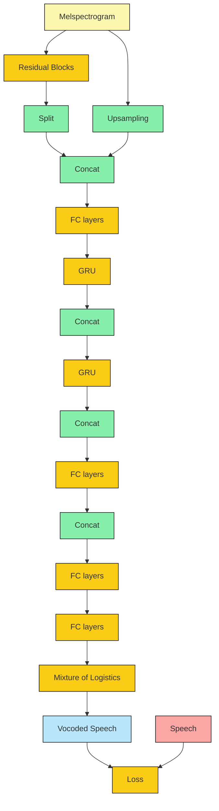

I'm working as a working student at Fraunhofer IIS audio codec team and I'm responsible for WaveRNN and LPCNet models. In this post, I'll go over these papers and give a short summary.

---

#### **Efficient Neural Audio Synthesis, 2018**
WaveRNN

**Problem:** WaveNet achieves excellet performance but requires high end GPUs to run and not real time (0.3x real time). 

**Solution:** WaveRNN is a single layer RNN + dual softmax layer model and works 4x real time in GPU. Sparse WaveRNN has a very sparse (only 4% non-zero weights) large network instead of dense shallow network, and can run on mobile CPU.

**Model:** The WaveRNN model mainly consists of a gated recurrent unit (GRU), followed by two fully-connected layers, ending in a softmax activation. It is computed as

$$
\begin{align*}
\begin{split}
\mathbf{x}_{t} &= [s_{t-1}; \mathbf{f}] \\ 
\mathbf{u}_{t} &=  \sigma (\mathbf{W}^{(u)}\mathbf{h}_{t-1} + \mathbf{U}^{(u)}\mathbf{x}_{t}) \\
\mathbf{r}_{t} &=  \sigma (\mathbf{W}^{(r)}\mathbf{h}_{t-1} + \mathbf{U}^{(r)}\mathbf{x}_{t}) \\
\mathbf{\tilde{h}}_{t} &=  tanh (\mathbf{r}_t \circ (\mathbf{W}^{h}\mathbf{h}_{t-1}) + \mathbf{U}^{h}\mathbf{x}_{t}) \\
\mathbf{h}_{t} &=  \mathbf{u}_t \circ \mathbf{h}_{t-1} + (1 - \mathbf{u}_t) \circ \mathbf{\tilde{h}}_{t} \\
P(s_t) &= softmax (\mathbf{W}_2 relu(\mathbf{W}_1 \mathbf{h}_t)) 
\end{split} 
\end{align*}    
$$

where $$\mathbf{W}$$ and $$\mathbf{U}$$ matrices are GRU weights and $$\sigma$$ is the sigmoid function. Note that this version (not original) does not consider fine and coarse bit seperation. 

The output is 24 *kHz* 16-*bit* waveform. WaveRNN-896 has 3M parameters.

Authors also apply pruning scheme to sprasify matrices. At the beginning of training, the weight matrices are dense. Every 500 steps, the weights within each sparsified layer are sorted by their magnitude and the mask is updated by zeroing out k weights with the smallest magnitude. The number k is computed as a fraction z of the total number of weights, which is gradually increased from 0 to the target sparsity Z as a function of the training step t.

---
#### **LPCNET: Improving Neural Speech Synthesis Through Linear Prediction, 2019**

It is a WaveRNN variant but aggragates linear prediction. 

**Problem:** Low complexity parametric synthesis models such as low bitrate vocoders have existed for a long time, but their quality has always been severely limited.

A neural speech synthesizer WaveNet, gave promising results in real time with a high-end GPU to provide the tens of billions of floating-point operations per second. WaveRNN has focused on finding more efficient models in order to reduce the complexity of speech synthesis. But audio quality can still be improved.

**Solution:** LPCNet model takes the burden of spectral envelope modeling away from a neural synthesis network so that most of its capacity can be used to model a spectrally flat excitation.

The idea is actually very similar to ResNet and combined with classical DSP methods. We know that our generated speech is non linear. But the vocal tract response can be modelled with a linear model reasonably well. To be precise, we can say that 

$$

s_t = p_t + e_t

$$

where $$s_t$$ is the speech signal at time $$t$$, $$p_t$$ is the linear estimation of speech signal and $$e_t$$ is the excitation (residual) signal. The estimation is a $$M$$th order filter

$$

p_t = \Sigma_{k=1}^{M} a_k s_{t-k}

$$

where $$a$$ parameters are the linear prediction coefficients (LPC). 

**Model:**  As I mentioned at the beginning, it is a WaveRNN variant. That mean WaveRNN-like architecture is used for estimating excitation signal $$e_t$$ at sample rate of 16 *kHz*. Final output is still addition of the excitation and linear prediction.

Input features are 18 cepstral coefficients (time domain signal -> FFT -> log scale -> IFFT = ceptrum domain signal), pitch period and correlation coefficients. Therefore 20 features in total fed into the frame rate network (network for ) to compute feature vector $$\mathbf{f}$$ for 10-*ms* window. Same 20 features are also used for LPC computation.

Output of frame rate (feature) network $$\mathbf{f}$$, previous excitation $$e_{t-1}$$, previous speech signal $$s_{t-1}$$ and predicted signal $$p_t$$ are concatenated and used as an input to WaveRNN-like sample rate network. Estimated excitation signal is then summed with prediction to obtain final generated speech signal.

Because excitation signals are typically concantrated in low frequencies, authors used first order emphasis filter to tilt their frequency response instead of increasing 8-bit quantization to 16-bit quantization. The emphasize filter is $$ E(z) = 1 - \alpha z^{-1}$$. It is inversed at the output with a de-emphasize filter $$ D(z) = 1 / 1 - \alpha z^{-1}$$.